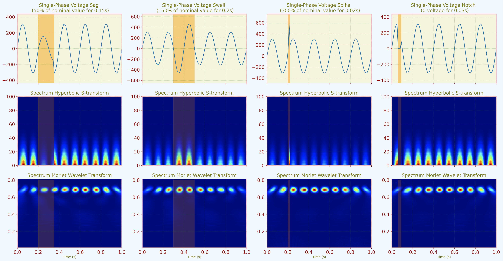

# Hyperbolic S-Transform

Package for Hyperbolic S-transform

## 1. Introduction

HS Transform is a Python package for performing Hyperbolic S-transforms. The S-transform is a time-frequency representation that combines the best properties of the Short-time Fourier Transform and the Wavelet Transform. It provides simultaneous information on both the frequency content and temporal localization of a signal.

## 2. Dependencies

HS Transform requires the following Python packages:

- numpy
- scipy
- pandas
- matplotlib
- pytest

## 3. How to Install

You can install HS Transform using pip:

```
pip install HSTransform
```

## 3. How to Install

After installation, you can test the package using the included test scripts:
`pytest tests/test_hstransform.py`
or
`python -m unittest tests/test_hstransform.py`

## 5. Example

Here’s an example of how to use HS Transform to analyze a signal with voltage disturbance and power system fault:
```
from hstransform import HyperbolicSTransform as HSTransform

# Create an instance of HSTransform

hs = HSTransform()

# Perform the transform

S = hs.fit_transform(time_values, input_signal)

# Plot the result

hs.plot(S)
```



## 6. Communication

If you have any questions, issues, or suggestions for HS Transform, please open an issue on the GitHub repository.
or contact email:

## 7. Citation

If you use HS Transform in your research, please cite it as follows:
